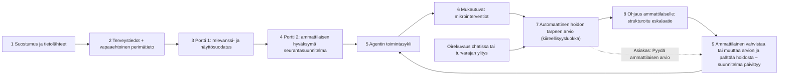

# Agenttinen hyvinvointikumppani – SOTE AI Hackathon 2026, LUVN-haaste 3

> **AI pitää omahoidon käynnissä arjessa myös vastaanottojen välissä.** Hyvinvointikumppani on omahoidon jatkuvuuden
> moottori, jolla on neljä ydintehtävää: se **muistaa puolestasi** (tavoitteet, sovitut asiat, mitä seurataan, mitä on
> kokeiltu, mikä toimii ja milloin tarkistetaan), **ottaa itse yhteyttä** ("Haluaisitko tehdä tällä viikolla kolmen
> päivän kotiseurannan?"), **auttaa yhden pienen askeleen kerrallaan** (tavoite, teko, palaute, mukautus ja uusi teko) ja
> **huomaa, milloin omahoito ei enää riitä** (jatketaanko omahoitoa, muutetaanko suunnitelmaa vai tarvitaanko ammattilaista).
>
> Emme näytä käyttäjälle kaikkea, mitä järjestelmä pystyy datasta löytämään. Muutamme vain relevantit, riittävän
> luotettavat, ammattilaisen hyväksymät ja käyttäjän sallimat signaalit aktiiviseksi seurantasuunnitelmaksi. Agentti
> toimii oma-aloitteisesti tämän suunnitelman rajoissa ja kutsuu ammattilaisen mukaan silloin, kun ihmisen päätöstä
> tarvitaan.
>
> Hyvinvointikumppani tekee hoidon tarpeen ja kiireellisyyden arvion automaattisesti sääntöjen perusteella; ammattilainen päättää hoidosta ja valvoo arvioita, ja asiakkaalla on aina oikeus ammattilaisen tekemään arvioon.

Kaikki henkilöt ja tiedot ovat **täysin synteettisiä**. Demohenkilö on **Aino Demo, 46 v**.

Sovellus tekee hoidon tarpeen ja kiireellisyyden arvion automaattisesti sääntöjen perusteella (ennakoi terveydenhuoltolain 51 §:n muutosta, oletettu voimaantulo 2027). Se ei tee diagnooseja, ei muuta hoitoa tai lääkitystä eikä esitä riskiprosentteja; hoitopäätökset tekee ammattilainen, ja ammattilaisen arvion voi aina pyytää.

Automaattinen hoidon tarpeen arvio ennakoi lakimuutosta, jota ei ole vielä säädetty: *terveydenhuoltolaki 51 § 3 mom. (digitaalinen hoidon tarpeen arvio) – prototyyppi olettaa lakimuutoksen voimaan 2027*. Oikeusperuste on siis
**oletus** – ks. [12. Lakimuutoksen huomiointi](#12-lakimuutoksen-huomiointi).

---

## 1. Mitä sovelluksessa oli ennen muutoksia

- **DNA-analyysi** (FastAPI + React): paikallinen jäsennys, vertailu ClinVar-/demotietoon, raportti. Toimi oikeasti.
- **Minun seuranta**: geenilöydöskeskeinen seurantalista (LDLR). Sääntömoottori muodosti huomion, kun LDL ylitti
  viitealueen. Mukana olivat myös "Miksi nyt?", ammattilaisyhteenveto ja "merkitse jaetuksi".
- **Hyvinvointikumppani-chat**: sääntöpohjainen intent-reititin, turvallisuusintentit (hätä, diagnoosi, lääkitys) aina
  säännöillä, tallennus vain käyttäjän vahvistuksella (`PendingAction`), proaktiiviset viestit tilamuutoksista.
- **Terveysaikajana**, kiinteä 8 kysymyksen **elämäntapatesti**, agenttiloki backendissä (ei käyttöliittymässä) sekä
  valinnainen LLM tekstipohja-fallbackilla.
- **Puuttui:** ammattilaisen näkymä ja päätökset, suostumus- ja viestintäasetukset, oma-aloitteinen toimintasykli,
  eskalaatio, henkilöprofiili- ja adapterikerros sekä vaikuttavuusnäkymä. DNA oli käytön lähtökohta, ja raaka tai
  epävarma variantti voitiin lisätä seurantaan suoraan raportista.

## 2. Mitä muutettiin

Workflow on nyt:



| Osa | Toteutus |
|---|---|
| **Tilanne nyt** (asiakkaan päänäkymä) | Tilanne ja seuraava askel ensin. Seurantateemat, edistyminen, seuraava tarkistus. "Miksi tätä seurataan?" on toinen taso. Ei riskilistaa. |
| **Seurantasuunnitelma** | `SupportPlan`, jossa id, teema, tila, prioriteetti, perustelu, tietolähteet ja päivämäärät, tavoite, signaalit, tiheys, sallitut ja kielletyt toimet, mikrointerventiot, eskalaatiosäännöt, vastuuammattilainen, hyväksyntä, käyttäjän suostumus, tarkistuspäivä, viimeisin agentin toimi ja ammattilaisen päätös, versio ja muutoshistoria. |
| **Tilakone** | `candidate → pending_professional_review → active ⇄ paused`, `active → escalated → active/completed`, `rejected`. Aktivointi vaatii ammattilaisen hyväksynnän ja käyttäjän suostumuksen. Tila `escalated` näkyy asiakkaalle muodossa *Arvioitu automaattisesti – ammattilainen mukana*. |
| **Agenttisykli** | havainnoi → vertaa suunnitelmaan → tunnista muutos → valitse pienin riittävä sallittu toimi → toteuta → odota vastausta → arvioi → päivitä tilannekuva → tee tarvittaessa automaattinen hoidon tarpeen arvio ja ohjaa ammattilaiselle → kirjaa kaikki. |
| **Mikrointerventiot** | 1–3 kysymyksen check-in suunnitelman perusteella. Jokaisella kysymyksellä on "Miksi kysyn". Vapaaehtoiset kysymykset voi ohittaa. Jos tavoite ei toteudu, kysytään este ja tarjotaan pienempi tai vaihtoehtoinen tavoite – samaa ohjetta ei toisteta. |
| **Automaattinen arvio ja ohjaus** | Sääntömoottori tekee hoidon tarpeen ja kiireellisyyden arvion (`CareAssessment`: kiireellisyysluokka, hoidon tarve, käsittelyaika, peruste, käytetyt tiedot ja säännöt, kiinteä lakiviite) ja ohjaa tilanteen vastuuammattilaiselle strukturoidulla yhteenvedolla: syy, havaittu muutos, aikajana, lähteet, käytetty sääntö, agentin aiemmat toimet, käyttäjän vastaukset, kiireellisyysluokka (arviosta) ja avoin päätös. Asiakas voi aina pyytää ammattilaisen arvion. |
| **Oirekuvaus chatissa** | Asiakas voi kuvata oireensa Hyvinvointikumppanille. Oiretaulukko (`TRI-*`) ja kontekstisäännöt antavat luokan; hätäoireet saavat kiinteän 112-ohjeen eivätkä kuulu automaattisen arvion piiriin. Vastauksessa on *Pyydä ammattilaisen arvio*. |
| **Ammattilaisen näkymä** | Työjono (hyväksyntää odottavat, *Automaattiset arviot (valvonta)*, eskaloidut, arviointi lähestyy, aktiiviset, perimätiedon arviopyynnöt, portin 1 suodattamat). Arvion valvonta: *Vahvista arvio*, *Muuta kiireellisyysluokkaa*, *Tee arvio itse (ammattihenkilön arvio)*. Yhdeksän päätöstyyppiä, joista jokainen päivittää suunnitelman version. |
| **Suostumukset** | Tietolähteet, oma-aloitteiset yhteydenotot, yhteydenottoraja, hiljaiset ajat, kanava, perimätiedon yksityiskohdat ja tauko – koko palvelulle tai teemakohtaisesti. Nimenomainen suostumus automaattiseen arvioon ("Hyväksyn, että hoidon tarpeen ja kiireellisyyden arvio tehdään automaattisesti") ja kuvaus *Näin automaattinen hoidon tarpeen arvio toimii*. |
| **Omahoidon jatkuvuuden moottori** | `continuity.py` ja *Omahoidon jatkuvuus* -paneeli (Hyvinvointikumppani, lyhyesti Tilanne nyt). **1 Muistan puolestasi:** tavoitteet, sovitut asiat, seurattavat asiat, kokeillut asiat, toimivat asiat (myös haasteet) ja tarkistuspäivät suunnitelmista, viikkokierroksista ja ammattilaisten kirjauksista. Kirjauksista poimitaan asiat policyn sääntöjen (`continuity.noteRules`) perusteella, ei perimätietoa, lääkitystä eikä diagnooseja. **2 Otan itse yhteyttä:** yhteydenottosääntö OUT-BP-001 ehdottaa kolmen päivän kotiseurantaa, kun kotimittausten taso nousee. Ehdotus näkyy chatissa, paneelissa ja Tilanne nyt -näkymässä, ja käyttäjä päättää. **3 Yksi askel kerrallaan:** seitsemän päivän askel, joka onnistuessaan kasvaa hieman (enintään ammattilaisen yläraja) ja muuten pienenee esteen mukaan. **4 Huomaan, milloin omahoito ei riitä:** suunta *Jatketaan omahoitoa / Muutetaan suunnitelmaa / Tarvitaan ammattilaista* sekä *Seuraan samalla* -lista. Kotiseurannan keskiarvo vähintään 145/90 mmHg johtaa sääntöön ESC-BP-004 (automaattinen arvio ja ohjaus). |
| **Hyvinvointidata (Apple Health)** | Uusi välilehti ja `backend/app/wellbeing/`. Apple Healthin päivittäiset yhteenvedot ovat yksi lisätietolähde samalle agentille. iOS-silta (`ios/HyvinvointiBridge`, HealthKit, vain luku) yhdistetään kertakäyttöisellä koodilla ja synkronoi laitetunnisteella. Muutoksia verrataan henkilökohtaiseen perustasoon: 7 päivää vs. oma 90 päivän taso. Vain aktiivisten seuranta-alueiden muutoksista tulee oma-aloitteinen havainto, joka on perusteltu (*Miksi näen tämän?*) ja avautuu chattiin (*Selvitetään yhdessä*). Agentin kontekstiin menee tiivis `wellbeingData`-yhteenveto, ei historiaa. Demossa on selvästi merkitty synteettinen 12 kuukauden data. |
| **Agentin toiminta** | Audit trail ja seitsemänvaiheiset toimintaketjut *Havainto → agentin toimi → käyttäjän vastaus → seuranta → automaattinen arvio → eskalaatio → ammattilaisen päätös*. |
| **Vaikuttavuus** | Demotapauksen mittarit (myös automaattiset hoidon tarpeen arviot, ammattilaisen vahvistamat ja muuttamat, pyydetyt ammattilaisen arviot) ja 50 000 hengen synteettinen pilottikohortti, laskettu palvelimella. |
| **Adapterit** | LUVN-tyyppinen CSV/JSON → `PersonProfile` (ks. [docs/LUVN_ADAPTER.md](docs/LUVN_ADAPTER.md)). |
| **Perimätieto** | Vapaaehtoinen lisätietolähde. Portti 1 näkyy yhdellä silmäyksellä (hyväksytty, arviota odottava, suodatettu). Oman DNA-analyysin raportti ryhmitellään portin 1 luokkiin, ja "Lisää seurantaan" on korvattu toiminnolla "Pyydä ammattilaisen arvio". |
| **Elämäntapatesti** | Säilyy vapaaehtoisena laajana kyselynä. Kuukausittaisen kyselyn korvaavat adaptiiviset check-init. |

## 3. Miten tämä vastaa LUVN:n haasteeseen

| LUVN:n tarve | Ratkaisussa |
|---|---|
| Toimii asiakkaan rinnalla pitkällä aikavälillä | Versioitu seurantasuunnitelma ja viikoittainen agenttisykli, joka jatkaa ammattilaisen päivittämän version mukaan. |
| Seuraa tilanteen kehittymistä | Signaalit: puuttuvat mittaukset, keskiarvo ja trendi, tavoitteen toteutuminen, vanhentunut tieto, tarkistuspäivä, uusi huoli, toistuvat yhteydenotot. |
| Muistuttaa oikea-aikaisesti | Muistutukset ja check-init suunnitelman tiheydellä, hiljaiset ajat ja viikoittainen yhteydenottoraja huomioiden. |
| Henkilökohtaiset mutta turvalliset vinkit | Vain hyväksytyt ohjeet ja tavoitteet ammattilaisen asettaman vaihteluvälin sisällä. |
| Mukauttaa tukea | Este → pienempi tai vaihtoehtoinen tavoite. Kipu tai vaiva → ei liikuntaohjetta, vaan hoidon tarpeen arvio ja tarjous ammattilaisen yhteydenotosta. |
| Ohjaa ammattilaiselle | Automaattinen, sääntöpohjainen hoidon tarpeen ja kiireellisyyden arvio ja strukturoitu ohjaus vastuuammattilaiselle (hoitaja, lääkäri, genetiikan asiantuntija…). Ammattilainen vahvistaa tai muuttaa arvion ja päättää hoidosta; asiakas voi aina pyytää ammattilaisen arvion. |
| Hyödyntää luvalla luotettavaa tietoa, ei uudelleenkirjaamista | Adapterit lukevat diagnoosit, lääkityksen, käynnit, kirjaukset, asioinnit ja mittaukset. Suostumus rajaa lähteet. |
| Oma-aloitteinen, ei kysymys–vastaus-chat | Agentti aloittaa itse. Chat on yksi käyttöliittymä samaan agenttiin. |
| Perustaso ilman asiakkuutta, enemmän personointia kun tietoa on | Sovellus toimii pelkillä terveystiedoilla. Perimätieto tai lisälähteet tarkentavat, eivätkä ole edellytys. |
| Yleiskäyttöisyys (esim. eroperheet myöhemmin) | Suunnitelma-, suostumus-, eskalaatio- ja audit-mallit eivät ole terveydenhuoltospesifejä. Teemat ja policyt ovat dataa (`data/support/policies.json`). |

## 4. Kolmen portin turvallisuusmalli

**Portti 1 – relevanssi ja toimintakelpoisuus** (`app/support/relevance.py`)
- Luokat: *ei käytännön merkitystä*, *epävarma tai ristiriitainen*, *vaatii ammattilaisen tarkistuksen*,
  *mahdollisesti toimintakelpoinen* ja *ammattilaisen hyväksymä seurantakohde*.
- Epävarma variantti (Ainon MTHFR) ja pelkkä tilastollinen yhteys (APOE) eivät näy asiakkaalle eivätkä vaikuta
  ohjaukseen. Ne näkyvät ammattilaiselle kohdassa *Portti 1: suodatetut havainnot*.
- Terminologia on "variantti", "havainto" ja "mahdollinen perimään liittyvä tekijä" – ei koskaan "DNA-virhe".
  Vahvistamaton havainto merkitään vahvistamattomaksi.
- Terveystiedoissa teema muodostuu vain diagnoosista. Yksittäinen mittaus ilman diagnoosia ei synnytä seurantaa.

**Portti 2 – ammattilaisen hyväksyntä ja valvonta** (`app/support/professional.py`, `assessment.py`)
- Päätökset: *Hyväksy*, *Muokkaa*, *Hylkää*, *Pyydä lisätietoa*, *Jatka nykyistä seurantaa*, *Muuta agentin
  toimintavaltuuksia*, *Ota yhteyttä käyttäjään*, *Päätä seuranta* ja *Aseta uusi tarkistuspäivä*.
- Ammattilainen voi muuttaa mittaustiheyttä, tarkistusväliä, demo-tavoitetasoa, tavoitetta ja sen vaihteluväliä,
  eskalaatiorajaa, vastuuroolia ja ohjeita. Agentin toimintavaltuuksia voi rajata, mutta kiellettyjä toimia ei voi sallia.
- Ammattilainen valvoo automaattisia arvioita työjonon ryhmässä *Automaattiset arviot (valvonta)*: **Vahvista arvio**,
  **Muuta kiireellisyysluokkaa** tai **Tee arvio itse (ammattihenkilön arvio)**. Ohjauksen ratkaisussa kysytään
  *Oliko automaattinen kiireellisyysarvio oikea?*.
- Lääkäri ei ole pullonkaula: verenpaineseurannan omistaa sairaanhoitaja, kolesteroliseurannan lääkäri, ja
  perimähavainto voidaan ohjata genetiikan asiantuntijalle.

**Portti 3 – käyttäjän suostumus ja viestintä** (`app/support/consent.py`, `user_actions.py`)
- Pois kytketty tietolähde ei mene agentille eikä kielimallille. Perimätiedon poisto pysäyttää myös geneettisen seurannan.
- Oma-aloitteiset yhteydenotot, viikoittainen raja, hiljaiset ajat ja kanava (sovellus, tekstiviesti tai sähköposti –
  kaksi jälkimmäistä mallinnettuja). Palvelu tai teema voidaan tauottaa.
- Nimenomainen suostumus automaattiseen hoidon tarpeen arvioon on oma valintansa. Jos se perutaan, uudet arviot ovat
  esiarvioita, jotka ammattilainen tekee.
- Ennalta määritelty turvaviesti (demo-turvaraja ylittyy) menee aina perille, koska ammattilainen on hyväksynyt sen osana
  suunnitelmaa. Se alkaa "Automaattinen hoidon tarpeen arvio: kiireellinen, hoidettava samana päivänä." ja mainitsee
  aina hätänumeron 112.

**Automaattinen hoidon tarpeen arvio (HTA)** (`app/support/assessment.py`, `data/support/policies.json` → `automation`)
- Sääntömoottori antaa yhden viidestä luokasta: *Hätätilanne*, *Kiireellinen – samana päivänä*, *Kiirevastaanotto 3
  arkipäivän kuluessa*, *Kiireetön*, *Omahoito riittää*. Luokka tulee aina säännöistä: suunnitelman ohjaussäännöt
  (`ESC-*`), turvaraja, oiretaulukko (`TRI-*`) ja kontekstisäännöt (`TRI-CTX-*`), jotka voivat vain nostaa luokkaa.
- Jokainen arvio kertoo olevansa automaattinen ja näyttää perustelun (*Näin arvio tehtiin*) sekä kiinteän lakiviitteen.
  Asiakas voi aina valita **Pyydä ammattilaisen arvio**.
- Ilman nimenomaista suostumusta arvio on esiarvio (*Esiarvio – ammattilainen tekee arvion*). Hätätilanteet eivät kuulu
  automaattisen arvion piiriin (112 tai Päivystysapu 116 117).
- Valvonta: jokainen ohjaukseen johtanut arvio vahvistetaan tai muutetaan, ja ilman ohjausta jääneistä arvioista 20 %
  nostetaan valvontajonoon (deterministinen otanta). Kaikki arviot kirjataan audit-lokiin vaiheena *Hoidon tarpeen
  arvio (automaattinen)*.

## 5. Säännöt, kielimalli ja ihminen

**Sääntöpohjaista (ratkaisee)**
- Portin 1 luokittelu, tilakone ja versiointi
- Agentin toimenpiteen valinta ("pienin riittävä"), signaalit ja eskalaatiosäännöt
- Automaattinen hoidon tarpeen ja kiireellisyyden arvio: ohjaussäännöt, turvaraja, oiretaulukko ja kontekstisäännöt →
  kiireellisyysluokka, hoidon tarve ja käsittelyaika
- Check-in-kysymysten valinta ja jatkokysymykset
- Chatin turvallisuusintentit ja poikkeamamerkinnät

Kaikki raja-arvot ovat ammattilaisen asettamia **demo-policyja** (`data/support/policies.json`), eivät hoitosuosituksia.

**Kielimalli (valinnainen, `LOOP_LLM_PROVIDER=anthropic`)** – vain rajatut tekstitehtävät:
- ammattilaiselle menevän eskalaatiotiivistelmän luonnos rajatuista faktoista (ei nimeä, ei raakatekstejä, ei DNA:ta)
- hyväksytyn omahoito-ohjeen selkokielistäminen ilman sisällön muuttamista
- chatin intentin tunnistus ennalta määritellyistä kategorioista, vapaan tekstin jäsennys ja selitysten sävy
  (olemassa olevat toiminnot)

Jokainen LLM-teksti ajetaan deterministisen turvatarkistuksen läpi. Jos teksti hylätään tai kutsu epäonnistuu, käytetään
valmista tekstipohjaa. Audit-loki kertoo, käytettiinkö kielimallia ja mihin rajattuun tehtävään. **Kielimalli ei koskaan
aseta, muuta tai arvioi kiireellisyysluokkaa:** luokka annetaan sille syötteenä, ja tekstin on toistettava se
sellaisenaan (`check_text(text, allowed_urgency=…)`), muuten käytetään tekstipohjaa. **Demo toimii kokonaan
ilman kielimallia.** LLM-kontekstiin ei mene perimätietoa, jos käyttäjä on rajannut sen pois, eikä geenien nimiä, jos
yksityiskohtien näyttäminen ei ole sallittu.

**Agentti arvioi**
- Hoidon tarpeen ja kiireellisyyden automaattisesti sääntöjen perusteella, kertoo arvion olevan automaattinen ja
  perustelee sen. Agentti ei tee diagnooseja, hoitopäätöksiä eikä lääkitysohjeita.

**Ammattilainen päättää**
- Hyväksyy, muokkaa tai hylkää suunnitelman ja perimähavainnon käytön.
- Valvoo automaattisia arvioita: vahvistaa arvion, muuttaa kiireellisyysluokkaa tai tekee arvion itse, ja vastaa
  ohjauksen ratkaisussa, oliko automaattinen kiireellisyysarvio oikea.
- Päättää hoidosta ja päivittää suunnitelman.

**Asiakas päättää**
- Tietolähteistä, yhteydenotoista ja tauoista sekä siitä, saako hoidon tarpeen arvion tehdä automaattisesti.
- Hyväksyy pienemmän tavoitteen ja voi milloin tahansa pyytää ammattilaisen tekemän arvion.

## 6. Käynnistys

Vaatimukset: Python 3.12+ (demo toimii myös 3.9:llä ilman LLM-integraatiota) ja Node.js 20+.

```bash
./start-macos.sh
```

- Frontend: http://localhost:5180 · Backend: http://localhost:8002/api/health (portit voi vaihtaa:
  `BACKEND_PORT=… FRONTEND_PORT=… ./start-macos.sh`)
- Windows: `start.ps1` (backend 8000, frontend 5173).
- Kaikki tiedot ovat synteettisiä. **Palauta demo alkutilaan** -painike (Demo-ohjaus-paneeli) palauttaa tarinan alkuun.

## 7. Demotapaus vaihe vaiheelta (3–5 minuuttia)

Lähtötilanne 1.9.2026: Ainon kolesteroliseuranta on lääkärin hyväksymä ja vakaa. Verenpaineen omaseurannan ehdotus on
muodostunut terveystiedoista ja odottaa hoitajan hyväksyntää.

Asiakkaan välilehdet ovat järjestyksessä Perimätieto → Terveystiedot → Hyvinvointikumppani → Suostumukset → Tilanne nyt
→ Agentin toiminta, ja jokaisen näkymän lopussa on linkki seuraavaan. Demo-ohjaus-paneeli (Tilanne nyt) näyttää
seitsemänvaiheisen tarinan ja merkitsee tehdyt vaiheet tilan perusteella.

1. **Perimätieto (Asiakas).** Portti 1 yhdellä silmäyksellä: yksi hyväksytty taustatieto (kolesteroliseurannalle),
   nolla arviota odottavaa, kaksi suodatettua. Geenien nimiä ei näytetä, koska yksityiskohdat on piilotettu
   suostumuksissa. Oma DNA-analyysi on valinnainen lisä.
2. **Terveystiedot.** Terveydenhuollon kirjaukset kansallisen terveystietonäkymän tapaan, uusin ensin: tekstimerkinnät,
   laboratoriotutkimukset, mittaukset, diagnoosit ja lääkitys. Avaa esimerkiksi *Lipidit* (7 tulosta) tai
   *B -Perusverenkuva, minidiff, vieritutkimus* (17 tulosta): tulokset näkyvät taulukkona viitearvoineen ja poikkeavat
   merkittyinä. Lähteet näkyvät tiedostoina, jotka adapterit lukivat – mitään ei kirjattu uudelleen.
   Paina **Linkitä DNA-analyysiin**: agentti yhdistää sääntöjen perusteella terveystiedot ja DNA-analyysin havainnot
   aiheittain. *Kohonnut kolesteroli* kokoaa diagnoosin, lipiditutkimukset vuodesta 2014 (LDL nousee vähitellen) ja käynnit
   kirjauksineen sekä kaksi perimätiedon havaintoa – toinen on ammattilaisen hyväksymä taustatieto, toista ei käytetä. Verenpaineelle
   ja sokerille ei löydy DNA-havaintoa, eikä muita DNA-löydöksiä nimetä. Linkitys kirjataan Agentin toiminta -näkymään,
   eikä se muuta seurantaa (portit 2 ja 3).
3. **Suostumukset.** Portti 3: tietolähteet, oma-aloitteiset yhteydenotot, viikkoraja, hiljaiset ajat, kanava,
   perimätiedon yksityiskohdat ja tauko. Uusi osio *Automaattinen hoidon tarpeen arvio*: valinta "Hyväksyn, että hoidon
   tarpeen ja kiireellisyyden arvio tehdään automaattisesti" (annettu vastaanotolla, synteettinen) ja kuvaus *Näin
   automaattinen hoidon tarpeen arvio toimii* (oikeusperuste oletukseksi merkittynä, periaatteet, luokat, vastuuhenkilö).
4. **Tilanne nyt.** "Seuranta etenee suunnitelman mukaan." Avaa *Miksi tätä seurataan?* kolesteroliteemasta:
   lähteet ja päivämäärät, lääkärin hyväksyntä, mitä agentti saa ja ei saa tehdä. Perimätieto näkyy vain neutraalina
   "mahdollisena perimään liittyvänä tekijänä".
5. **Ammattilainen → Työjono.** *Verenpaineen omaseuranta* odottaa hyväksyntää. Sivu näyttää ensin suunnitelman
   lyhyesti ja päätöspainikkeet; *Mistä ehdotus muodostui* (diagnoosi, lääkitys, hoitajan kirjaus, mittaukset,
   asioinnit) ja *Portti 1: suodatetut havainnot* (MTHFR, APOE) ovat avattavissa. Valitse **Hyväksy suunnitelma →
   Vahvista**. (Vaihtoehto: *Simuloi ammattilaisen päätös*.)
6. **Asiakas → Hyvinvointikumppani.** Hyväksyntäviesti antaa ensimmäisen askeleen: "Kokeillaan seuraavat 7 päivää yhtä
   asiaa: 30 minuutin kävely kaksi kertaa. Lisäksi sovittiin kaksi kotimittausta viikossa. Kysyn 8.9.2026, miten meni."
   Hyväksytty mittausohje liitettiin, koska Aino on kysynyt mittaamisesta kahdesti. *Omahoidon jatkuvuus* -paneelissa
   **1 Muistan puolestasi** näyttää kuusi asiaa: tavoitteet, sovitut asiat (esim. hoitajan kirjauksesta 20.8.2026 "Omahoidon
   tavoitteeksi sovittiin kaksi 30 minuutin kävelyä viikossa"), mitä seurataan, mitä on kokeiltu (aiemmat ohjaukset
   vuodesta 2014), mikä toimii ("LDL-arvo laskenut ruokavaliomuutosten jälkeen"; haasteena työn kiire) ja
   tarkistuspäivät. **3 Yksi askel kerrallaan** näyttää kierroksen *tavoite → teko → palaute → mukautus → uusi teko*.
   Chatissa voi kysyä *Mitä olemme sopineet?*, *Mikä on seuraava askel?* tai *Riittääkö omahoito?*.
7. **Tilanne nyt → Simuloi seuraava viikko** (8.9.). Agentti aloittaa itse viikkotarkistuksen: "Kokeilimme seitsemän
   päivää yhtä asiaa: 30 minuutin kävely kaksi kertaa. Miten se sujui?" Jokaisella kysymyksellä on *Miksi kysyn*.
   Vastaa **Ei tällä kertaa → Aika tai kiire → Sopii** (chatissa, Tilanne nyt -näkymässä tai *Simuloi käyttäjän
   vastaus*). Agentti ei toista ohjetta, vaan pienentää askelta hoitajan vaihteluvälin sisällä ("20 minuutin kävely
   kerran"). Suunta: **Muutetaan suunnitelmaa**. (Jos askel toteutuu, agentti ehdottaa hieman isompaa askelta
   ammattilaisen ylärajaan asti: "30 minuutin kävely kolme kertaa".)
8. **Lisää uusi mittaus** kahdesti (138/88, 140/89). Agentti huomaa nousun (132/84 → 137/88 mmHg) ja **ottaa itse
   yhteyttä** säännön OUT-BP-001 perusteella: "Verenpaineesi on ollut viime viikkoina hieman aiempaa korkeampi…
   Haluaisitko tehdä tällä viikolla kolmen päivän kotiseurannan?" Valitse **Kyllä, aloitetaan** ja **Simuloi
   kotiseuranta (3 pv)** (kuusi mittausta aamulla ja illalla, demopäivä siirtyy 10.9.). Agentti tekee yhteenvedon
   suunnitelman säännöillä: keskiarvo 140/89 mmHg on hieman tavoitetason yläpuolella → **Muutetaan suunnitelmaa**
   hoitajan rajoissa. (Jos keskiarvo olisi vähintään 145/90 mmHg, sääntö ESC-BP-004 toisi ammattilaisen mukaan.)
9. **Simuloi seuraava viikko** ja vastaa taas "Ei tällä kertaa". Omahoito ei enää riitä: sääntö ESC-BP-001 täyttyy, koska
   askel ei ole toteutunut kahdesti ja keskiarvo on sovitun tason yläpuolella. Agentti ei enää pienennä askelta. Se tekee
   **automaattisen hoidon tarpeen arvion** – *Kiireetön*, hoitajan yhteydenotto 5 arkipäivän kuluessa – ja ohjaa
   tilanteen hoitajalle. Aino saa rauhallisen viestin: "Tein tilanteestasi automaattisen hoidon tarpeen arvion:
   Kiireetön. Hoitajasi ottaa yhteyttä 5 arkipäivän kuluessa. … Voit aina pyytää ammattilaisen tekemän arvion – tämä
   ei vaadi sinulta nyt muuta." *Tilanne nyt* näyttää arviokortin: luokka, *Näin arvio tehtiin* (peruste, sääntö,
   lakiviite oletukseksi merkittynä) ja **Pyydä ammattilaisen arvio**.
10. **Ammattilainen → Työjono.** Ryhmässä *Automaattiset arviot (valvonta)* on arvio luokkineen, perusteineen ja
    sääntöineen. Valitse **Vahvista arvio** (vaihtoehdot *Muuta kiireellisyysluokkaa* ja *Tee arvio itse
    (ammattihenkilön arvio)*). *Eskaloidut*: automaattinen arvio ja ohjaus – syy, havaittu muutos, aikajana, sääntö,
    agentin toimet, vastaukset, kiireellisyys ja avoin päätös. Valitse **Muokkaa suunnitelmaa** (esim. 14 mittausta,
    taukoliikunta 3 × 10 min, ohje "Tee kotimittaus aamulla ja illalla…", *Oliko automaattinen kiireellisyysarvio
    oikea?: Kyllä*, *Ilmoita asiakkaalle*) tai *Simuloi ammattilaisen päätös*. Suunnitelma nousee versioon 2. (Jos
    arviota ei vahvisteta erikseen, suunnitelmapäätös kirjaa vastauksen arvioon.)
11. **Asiakas.** Seuraava askel on hoitajan uusi ohje, ja chatissa on tieto, että hoitaja vahvisti automaattisen arvion,
    sekä tieto päivityksestä. Suunta on taas **Jatketaan omahoitoa** (versio 2), ja uusi askel on "10 minuutin
    taukoliikuntahetki kolme kertaa". **Simuloi seuraava viikko:** agentti kysyy nyt version 2 askeleesta, eikä eskaloi
    uudelleen jo käsiteltyjen asioiden perusteella.
12. **Agentin toiminta.** Seitsemänvaiheinen toimintaketju *Havainto → agentin toimi → käyttäjän vastaus → seuranta →
    automaattinen arvio → eskalaatio → ammattilaisen päätös* ja audit-loki (sääntö, arvion kiireellisyysluokka, LLM
    kyllä/ei, vastaukset, päätökset). Agentin oma yhteydenotto on oma ketjunsa: *Havaitut signaalit: Mittausten trendi
    nousussa → ehdotus kotiseurannasta (OUT-BP-001) → vastaus → kotiseuranta ja yhteenveto*. Asiakkaan näkymässä
    geenien nimet on peitetty suostumuksen mukaisesti.
13. **Ammattilainen → Vaikuttavuus.** Demotapauksen mittarit (myös automaattiset hoidon tarpeen arviot, ammattilaisen
    vahvistamat ja muuttamat sekä pyydetyt ammattilaisen arviot) ja synteettinen 50 000 hengen kohortti (automaattisia
    arvioita, vahvistettujen osuus) – selvästi merkittynä simuloiduksi.

Lisänäytöt tarpeen mukaan:
- **Hyvinvointidata:** *Yhdistä Apple Health* näyttää iPhone-sillan yhdistämiskoodin (selain ei pääse HealthKitiin). Demossa
  valitse *Käytä synteettistä testidataa*: 12 kuukautta selvästi merkittyä synteettistä dataa, josta perustaso ja trendit
  lasketaan. Palautumisen seuranta-alueella leposyke on noussut (47 → 53 bpm), HRV laskenut ja uni vähentynyt, joten
  agentti nostaa havainnon *Huomasin muutoksen* välilehdelle ja chattiin. *Miksi näen tämän?* näyttää luvut, oman tason,
  kynnyksen ja lähteen. *Selvitetään yhdessä* avaa keskustelun, jossa data, tulkinta ja seuraava askel ovat erillään. Askel
  on hyväksytty ohje ja viikon seuranta tai ammattilaisen arvio. Askelmäärän lasku näkyy *Merkittävissä muutoksissa*, mutta
  sitä ei nosteta esiin, koska aktiivisuus ei ole seurannassa. Kytke *Aktiivisuus ja kunto* päälle, niin se nousee.
- **Oirekuvaus chatissa:** kirjoita Hyvinvointikumppanille "Minulla on ollut pari päivää päänsärkyä ja huimausta,
  pitäisikö mennä lääkäriin?" tai valitse Demo-ohjauksesta *Simuloi oirekuvaus chatissa*. Sääntö TRI-BP-003 antaa
  luokan *Kiirevastaanotto 3 arkipäivän kuluessa* ("Kiitos, että kerroit. Automaattinen hoidon tarpeen arvio: …"), ja
  tieto välittyy hoitajalle. Valitse **Pyydä ammattilaisen arvio** tai kirjoita "Haluan ammattilaisen tekemän
  arvion.": pyyntö näkyy työjonossa merkinnällä *Asiakas pyysi ammattilaisen tekemän arvion*.
- **Hätäoire:** kirjoita esim. "Minulla on rintakipua." Vastaus on kiinteä 112-ohje ilman kielimallia; hätätilanne ei
  kuulu automaattisen arvion piiriin, joten *Pyydä ammattilaisen arvio* -painiketta ei tarjota.
  Tapaus kirjataan lokiin.
- **Suostumuksen peruminen:** kytke Suostumuksissa automaattinen arvio pois ja simuloi oirekuvaus. Vastaus on
  *Esiarvio – ammattilainen tekee arvion*, ja työjonossa lukee "Asiakas ei ole antanut suostumusta automaattiseen
  arvioon: tee hoidon tarpeen arvio itse."
- **Suostumukset:** kytke *Oma-aloitteiset yhteydenotot* pois ja käynnistä agenttikierros. Toimi lykkääntyy, ja syy
  kirjataan lokiin.
- **Tilanne nyt:** kirjaa mittaus 186/112. Kiinteä turvaviesti "Automaattinen hoidon tarpeen arvio: kiireellinen,
  hoidettava samana päivänä. …" (aina 112, ei kielimallia) ilmestyy, ja samana päivänä käsiteltävä ohjaus muodostuu
  (ESC-BP-002).
- **Perimätieto:** aja *Käytä testi-DNA:ta*. Raportti ryhmittyy portin 1 luokkiin, epävarmat ovat piilossa, ja
  arvioitavissa on *Pyydä ammattilaisen arvio*.

## 8. Mallinnetut integraatiot (ei oikeita)

- LUVN:n potilas- ja asiakastietojärjestelmät → synteettiset CSV/JSON-poiminnat ja adapterit
- Ammattilaisen työjono ja päätökset → sovelluksen sisäinen roolinvaihto (ei tunnistautumista)
- Tekstiviesti- ja sähköpostikanava → vain merkintä viestissä, mitään ei lähetetä
- Palvelujen yhteystiedot (hoitajan puhelinpalvelu, laboratorion ajanvaraus) → keksittyjä
- Ajastettu taustaprosessi → demo-ohjauksen painikkeet
- Automaattisen arvion vastuuhenkilö, suostumuksen kirjaus (SUO-03) ja julkaistu kuvaus toimintaperiaatteista →
  synteettisiä; kuvaus näkyy vain sovelluksessa, ei alueen verkkosivuilla
- Vaikuttavuus → simuloitu kohortti

## 9. Ennen oikeaa hyvinvointialuekäyttöä

- Kliininen sisältö: teemat, signaalit, tavoitetasot ja eskalaatiosäännöt vastuullisten ammattilaisten laatimiksi ja
  hyväksymiksi, versionhallittuina (nyt demo-policyja).
- Tunnistautuminen, roolipohjainen pääsynhallinta, suostumusten kirjaaminen lähdejärjestelmiin ja lokien
  muuttumattomuus. Nyt asiakas- ja ammattilaisnäkymän data kulkee samassa rajapinnassa.
- Tietosuoja: DPIA, rekisteriseloste, käsittelyn oikeusperuste, säilytysajat ja kielimallin käsittelyympäristö (EU,
  sopimukset, ei koulutuskäyttöä).
- Lääkinnällisen laitteen sääntelyn (MDR) arviointi ja käyttötarkoituksen rajaus. Kliininen validointi,
  saavutettavuusauditointi (WCAG 2.1 AA) ja käyttäjätestaus asiakkaiden ja ammattilaisten kanssa.
- Oikeat integraatiot (FHIR/Kanta/alueen järjestelmät), tuotantotason tallennus (tietokanta nykyisen JSON-tiedoston
  sijaan), ajastus, valvonta ja häiriötilanteiden hallinta.
- Eskalaatioiden käsittelyprosessi: kuka kuittaa, missä ajassa, mitä tapahtuu poissaolojen aikana.
- **Automaattinen hoidon tarpeen arvio – lakimuutoksen edellytykset** (jos laki hyväksytään; ks. luku 12):
  - nimenomainen suostumus selkeän tiedon perusteella, kirjattuna lähdejärjestelmään, ja perumisen käsittely
  - oikeus ammattihenkilön arvioon: palveluprosessi, kuka arvion tekee ja missä ajassa
  - lääketieteellisesti hyväksyttävät kriteerit: sääntöjen laatiminen, hyväksyntä ja versiointi vastuullisten
    ammattilaisten toimesta (nyt synteettisiä demo-policyja)
  - laadunvarmistus ennen käyttöönottoa (kliininen validointi, erityisesti alikiireellisyyden riski) ja jatkuva seuranta
    (otantaosuuden perustelu, poikkeamien käsittely, raportointi)
  - riskienhallinta: potilasturvallisuus, oikeusturva (perustelut, muistutus ja kantelu) ja yhdenvertaisuus (kielet,
    saavutettavuus, digituki, vaihtoehtoinen asiointikanava)
  - vastuuhenkilön nimeäminen ja toimintaperiaatteiden kuvauksen julkaiseminen
  - MDR (ohjelmisto lääkinnällisenä laitteena), EU:n tekoälyasetus (AI Act) ja GDPR 22 artikla (automaattiset
    yksittäispäätökset)
  - hätätilanteiden rajaus: oiretaulukon kattavuus ja 112 / Päivystysapu 116 117 -ohjauksen testaus
  - alaikäiset: suostumus, huoltajan asema ja itsemääräämiskyky

## 10. Demon rajoitteet

- Yksi synteettinen demohenkilö. Kohortti on vain tilastoina ja sivutettuna listana.
- Aika etenee vain päivän tarkkuudella. Hiljaiset ajat vaikuttavat viestin toimitusaikaan, mutta demo ei simuloi
  vuorokauden kulkua.
- Perimätiedon sääntömoottorin vanha "Miksi nyt?" -näkymä näyttää geenin nimen myös silloin, kun yksityiskohdat on
  piilotettu (etusivu, chat, agentti ja LLM-konteksti noudattavat asetusta).
- Kielimalliominaisuudet vaativat Anthropic SDK:n (Python ≥ 3.10) ja API-avaimen. Ilman niitä käytetään tekstipohjia.
- Tila tallennetaan paikalliseen JSON-tiedostoon (`runtime/loop/state.json`), eikä rinnakkaisia käyttäjiä ole.
- Automaattisen arvion oiretaulukko on suomenkielinen avainsanahaku, ei validoitu hoidon tarpeen arviointityökalu: se ei
  kysy tarkentavia kysymyksiä eikä huomioi esimerkiksi oireen kestoa, ikää tai muita sairauksia. Valvontaotanta on
  deterministinen (joka viides ilman ohjausta jäänyt arvio).

## 11. Tekninen rakenne ja testit

- Hyvinvointidata: `backend/app/wellbeing/` (models, catalog, trends, analysis, sync, demo, observations, context, service,
  view, router; API `/api/health/*`), `frontend/src/wellbeing/` (WellbeingDataView, TrendChart), `ios/HyvinvointiBridge/`
  (HealthKit-silta) ja testit `backend/tests/test_wellbeing.py`.
- Backend: `backend/app/support/` (models, adapters, relevance, plan_state, signals, cycle, interventions, continuity,
  assessment, escalation, professional, user_actions, situation, impact, cohort, view, router). API: `/api/support/*`, mm.
  `POST /assessments/{id}/request-human-review`, `POST /assessments/{id}/review`, `POST /simulate/symptom-report`,
  `POST /home-monitoring/{id}/respond` ja `POST /simulate/home-monitoring`.
  Olemassa olevat `/api/loop/*` toimivat edelleen, ja niiden vastauksessa on uusi `support`-osa.
- Frontend: `frontend/src/support/` (ContinuityPanel, SituationView, AssessmentCard, AutomationNotice, PlanCard, CheckInCard,
  ConsentView, AuditView, ImpactView, GeneticSourcePanel, professional/* mm. AssessmentReview).
- Testit: `backend/tests/test_support_rules.py` (tilakone, portit, adapterit, tekstien turvatarkistus;
  kiireellisyysluokat ja lakisääteinen sanasto, policyn lakioletus, oiretaulukon ja kontekstisääntöjen deterministinen
  luokittelu, esiarvio ilman suostumusta, hätätilanteiden rajaus, valvontaotanta, `check_text` sallitulla luokalla,
  jokaisen arviotekstipohjan turvatarkistus) ja `test_support_flow.py` (agenttisykli, automaattinen arvio ja ohjaus,
  ammattilaisen arvion pyyntö myös chat-painikkeella, vahvistus, luokan muutos ja oma arvio, turvaraja ja 112,
  oirekuvauksen simulointi, ammattilaisen päätös, suostumukset, audit ja 7-vaiheinen ketju, LLM-rajaus – myös luokkaa
  muuttava tiivistelmä hylätään –, kohortti ja koko lakimuutoksen demopolku) sekä `test_continuity.py` (omahoidon
  jatkuvuuden moottori: muisti, askel, oma-aloitteinen kotiseuranta, suunta ja chatin vastaukset).

```bash
cd backend && .venv/bin/python -m pytest -q          # backend-testit
cd frontend && npx tsc --noEmit -p . && npm run build  # tyyppitarkistus ja build
```

## 12. Lakimuutoksen huomiointi

> **Oikeusperuste on oletus, ei voimassa olevaa lakia.** Proto rakentuu sosiaali- ja terveysministeriön luonnokseen
> "Hallituksen esitys eduskunnalle laiksi terveydenhuoltolain 51 §:n muuttamisesta (digitaalinen hoidon tarpeen arvio)", STM011:00/2026, lausuntokierros 4.5.–15.6.2026. Esityksellä ei ole vielä HE-numeroa eikä vahvistettua voimaantulopäivää.
> Sovelluksessa ja dokumentaatiossa lakiin viitataan aina muodossa:
> *terveydenhuoltolaki 51 § 3 mom. (digitaalinen hoidon tarpeen arvio) – prototyyppi olettaa lakimuutoksen voimaan 2027*.

Ehdotetun 51 §:n 3 momentin mukaan hyvinvointialue voisi käyttää automaatiota hoidon tarpeen ja kiireellisyyden
arvioinnissa. Automaation on perustuttava lääketieteellisesti hyväksyttäviin kriteereihin, potilaalla on aina oikeus
terveydenhuollon ammattihenkilön tekemään arvioon, ja automaatio edellyttää potilaan nimenomaista suostumusta selkeän
ja ymmärrettävän tiedon perusteella. Alueen on varmistettava laatu ennen käyttöönottoa ja seurattava sitä, hallittava
turvallisuuteen, oikeusturvaan ja yhdenvertaisuuteen liittyvät riskit, nimettävä vastuuhenkilö ja julkaistava selkeä
kuvaus automaation toimintaperiaatteista. Hätätilanteet eivät kuulu automaation piiriin (112 / Päivystysapu 116 117).
Hoitopäätökset tekee edelleen ammattilainen, ja diagnoosit, lääkitys ja hoito kuuluvat laillistetuille
ammattihenkilöille (ammattihenkilölaki 22 §, 23 a §).

| Edellytys (luonnos STM011:00/2026, ehdotettu 51 § 3 mom.) | Toteutus tässä protossa |
|---|---|
| **Nimenomainen suostumus** selkeän ja ymmärrettävän tiedon perusteella | *Suostumukset*-näkymässä oma valinta "Hyväksyn, että hoidon tarpeen ja kiireellisyyden arvio tehdään automaattisesti" ja kuvaus *Näin automaattinen hoidon tarpeen arvio toimii*. Tila `ConsentSettings.automatedAssessment`, tiedonantopäivä `automatedAssessmentInformedAt`; demossa suostumus on annettu hoitajan vastaanotolla 20.8.2026 (synteettinen kirjaus SUO-03). Ilman suostumusta arvio on vain **esiarvio** (`mode: professional_required`), ja ammattilainen tekee arvion. Suostumuksen antaminen ja peruminen kirjataan audit-lokiin. |
| **Oikeus terveydenhuollon ammattihenkilön arvioon** aina | Jokaisen arvion yhteydessä lause "Sinulla on aina oikeus terveydenhuollon ammattihenkilön tekemään arvioon." ja painike **Pyydä ammattilaisen arvio** (*Tilanne nyt* ja chat; chatissa myös omin sanoin). `POST /api/support/assessments/{id}/request-human-review` → tila `human_review_requested`: avoimeen ohjaukseen merkitään pyyntö, tai suunnitelman `user_request`-sääntö luo ohjauksen (ei toista arviota). Pyyntö näkyy ammattilaisen työjonossa omana merkintänään. |
| **Lääketieteellisesti hyväksyttävät kriteerit** | Arvion tekee sääntömoottori dokumentoiduista säännöistä: oiretaulukko `TRI-*`, kontekstisäännöt `TRI-CTX-*` (voivat vain nostaa luokkaa), suunnitelman ohjaussäännöt `ESC-*` ja ammattilaisen asettama turvaraja (`data/support/policies.json`, lohko `automation`). Viisi kiireellisyysluokkaa lakisääteisellä sanastolla (hätätilanne, kiireellinen, kiireetön), THL:n PTHAVO-tulosluokkia mukaillen. **Demossa kriteerit ovat synteettisiä demo-policyja, eivät kliinisesti validoituja.** |
| **Laadunvarmistus ennen käyttöönottoa ja seuranta** | Ennen: automaattiset testit (deterministinen luokittelu, jokainen arvion tekstipohja läpäisee turvatarkistuksen omalla luokallaan, kielimalli ei voi muuttaa luokkaa). Käytössä: ammattilaisen työjonon ryhmä *Automaattiset arviot (valvonta)* – jokainen ohjaukseen johtanut arvio vahvistetaan tai muutetaan (**Vahvista arvio**, **Muuta kiireellisyysluokkaa**, **Tee arvio itse (ammattihenkilön arvio)**), ja ilman ohjausta jääneistä arvioista 20 % nostetaan valvontaan deterministisellä otannalla. Ohjauksen ratkaisussa kysytään "Oliko automaattinen kiireellisyysarvio oikea?". *Vaikuttavuus* näyttää vahvistetut ja muutetut arviot. |
| **Riskienhallinta** (turvallisuus, oikeusturva, yhdenvertaisuus) | Säännöt ratkaisevat; kielimalli ei koskaan aseta kiireellisyysluokkaa. Sen tekstit tarkistetaan (`check_text(..., allowed_urgency=…)`), ja niiden on toistettava luokka sellaisenaan – muuten käytetään tekstipohjaa. Turvaraja- ja hätäviestit ovat kiinteitä. Jokainen arvio perusteluineen, sääntöineen ja ammattilaisen päätöksineen kirjataan audit-lokiin (vaihe *Hoidon tarpeen arvio (automaattinen)*). Yhdenvertaisuuden arviointi (kieliversiot, saavutettavuus, digituki) on tekemättä. |
| **Vastuuhenkilö** nimetty | `automation.responsiblePerson`: "Vastuuhenkilö: vastaava ylilääkäri (synteettinen demohenkilö)". Näkyy arviokortissa ja toimintaperiaatteiden kuvauksessa. |
| **Julkaistu kuvaus automaation toimintaperiaatteista** | *Näin automaattinen hoidon tarpeen arvio toimii* (Suostumukset, linkki arviokortista): oikeusperuste oletukseksi merkittynä, periaatteet, kiireellisyysluokat, mikä jää ammattilaiselle, vastuuhenkilö ja sääntöversio (`demo-1`). Jokaisen arvion kohdalla *Näin arvio tehtiin* (peruste, käytetyt tiedot, säännöt, lakiviite). |
| **Hätätilanteiden rajaus** | Hätätilanteeseen viittaavat oireet (`TRI-EMERG-001`) eivät kuulu automaattisen arvion piiriin: kiinteä ohje soittaa hätänumeroon 112 (tai Päivystysapuun 116 117), ei kielimallia eikä *Pyydä ammattilaisen arvio* -painiketta. Tapaus kirjataan (`mode: excluded_emergency`). |
| **Hoitopäätökset ammattilaisella** | Arvio ratkaisee vain yhteydenoton ja sen kiireellisyyden. Diagnoosit, hoitopäätökset (`treatment_decision`), lääkitys ja kliiniset raja-arvot ovat kiellettyjä agentin toimia, joita ammattilainenkaan ei voi sallia. Suunnitelmaa muuttavat vain ammattilaisen päätökset. |

**Epävarmuudet – proto ei ota näihin kantaa:**
- **Ei HE-numeroa.** Kyse on ministeriön luonnoksesta (STM011:00/2026), ei eduskunnalle annetusta hallituksen
  esityksestä.
- **Ei vahvistettua voimaantulopäivää.** Vuosi 2027 on prototyypin oletus.
- **Luonnos voi muuttua** lausuntokierroksen (4.5.–15.6.2026) jälkeen ja eduskuntakäsittelyssä: edellytykset,
  sanamuodot ja momenttinumerointi voivat muuttua, tai muutos voi jäädä toteutumatta.
- **Soveltamisala: perusterveydenhuolto.** 51 § koskee hoitoon pääsyä perusterveydenhuollossa. Proto tekee arvion
  omahoidon seurannan yhteydessä; se, kuuluuko tällainen jatkuva seuranta säännöksen piiriin, on tulkittava.
- **Alaikäiset: avoin.** Miten nimenomainen suostumus ja oikeus ammattihenkilön arvioon toteutuvat alaikäisillä
  (huoltajan asema, itsemääräämiskyky), on ratkaisematta. Demohenkilö on täysi-ikäinen.
- Suhde MDR:ään, EU:n tekoälyasetukseen ja GDPR:n 22 artiklaan on arvioitava erikseen (ks. luku 9). Tämä dokumentti ei
  ole oikeudellinen arvio.
